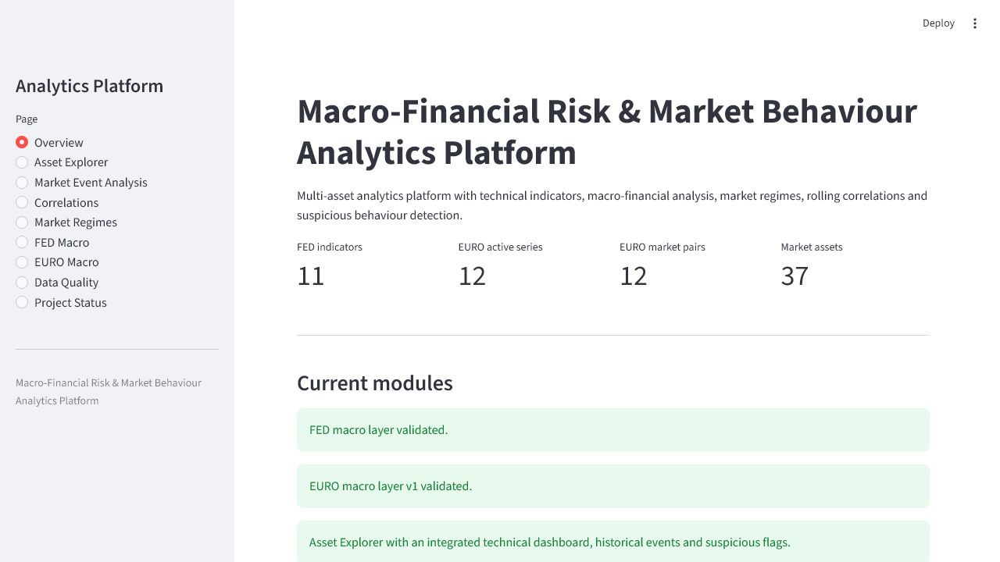
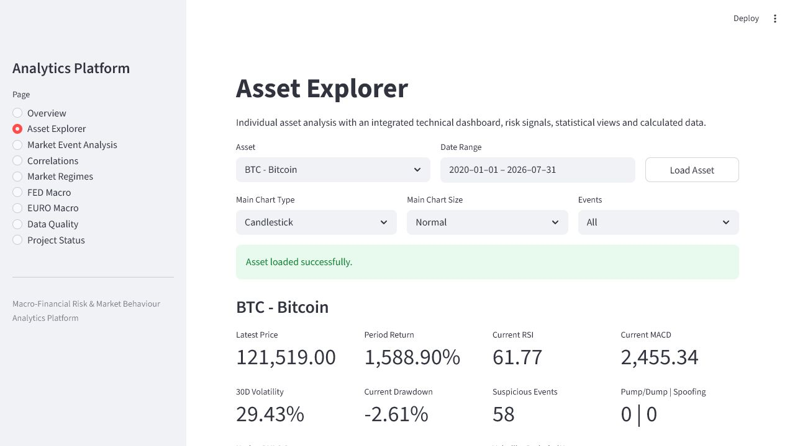
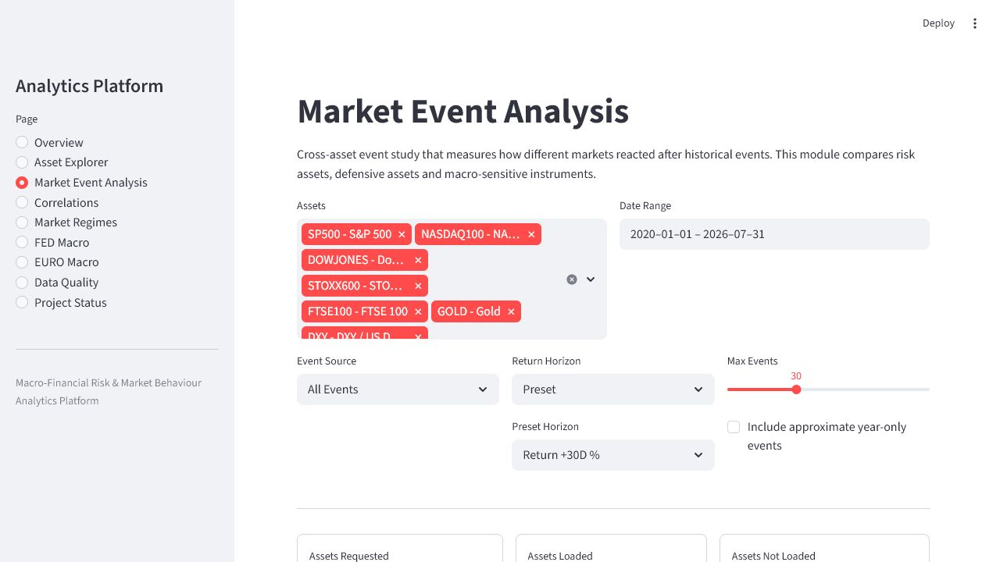
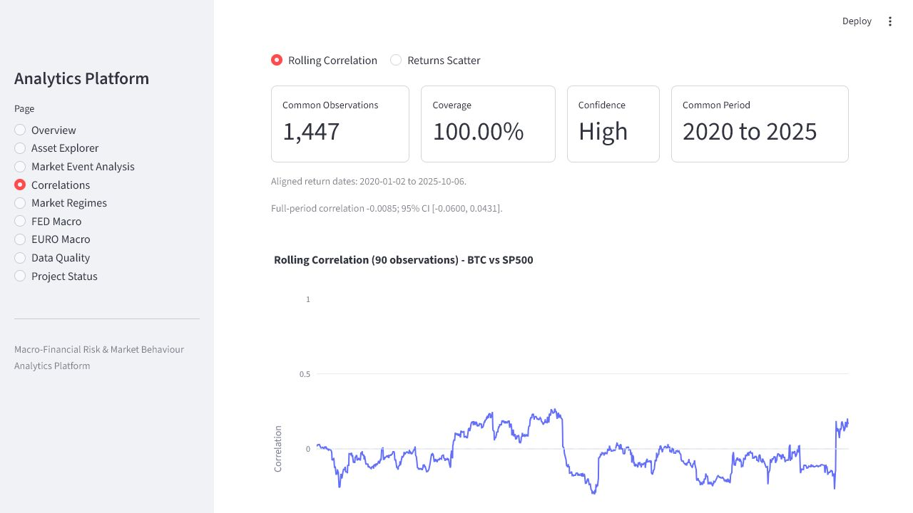
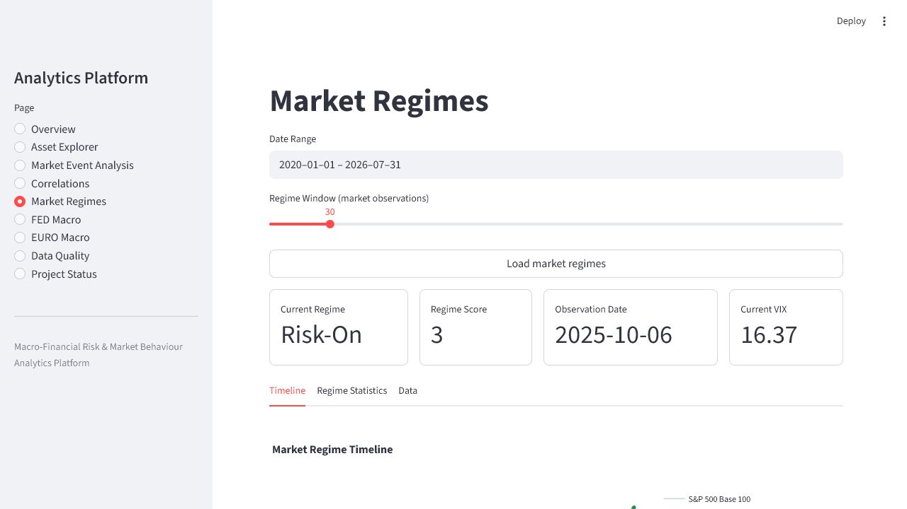
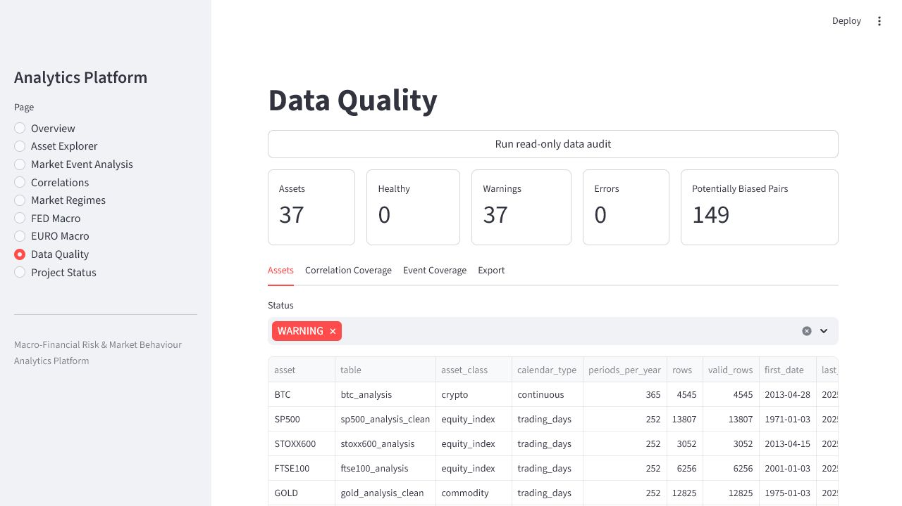
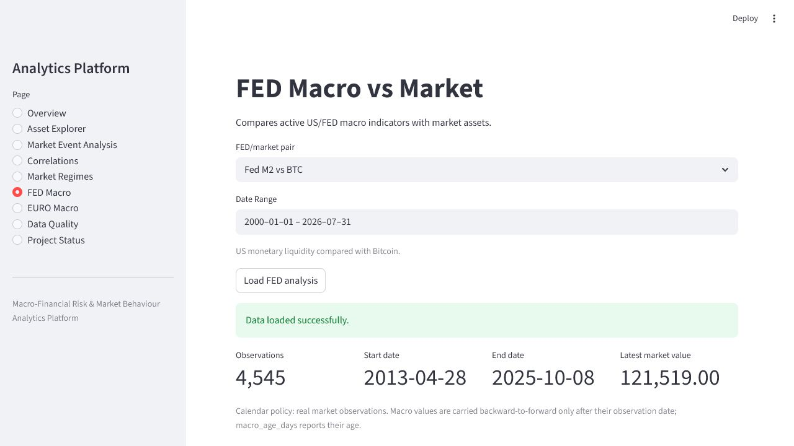
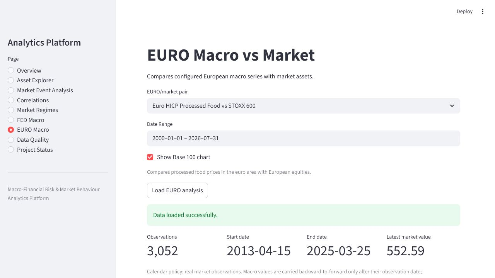
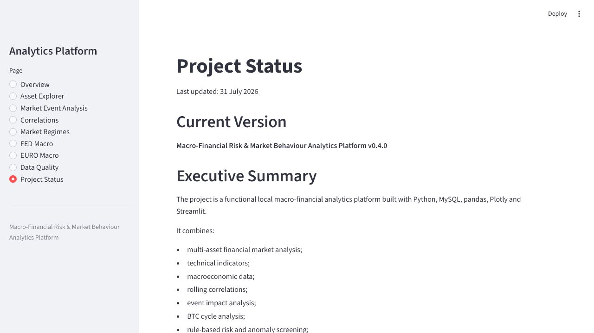

# Macro-Financial Risk & Market Behaviour Analytics Platform

A Python, MySQL, pandas, Plotly and Streamlit platform for analysing financial markets, macroeconomic indicators, correlations, event impact, technical indicators and rule-based market risk and anomaly signals.

The project was developed as a local analytics platform and professional portfolio project. Raw datasets, SQL dumps and private credentials are intentionally excluded from Git.

## Current Status

Functional local platform with:

- Interactive Streamlit dashboard.
- Multi-asset market analysis.
- Technical indicator engine.
- Rule-based risk and anomaly screening.
- FED macro-market analysis.
- EURO macro-market analysis.
- Multi-asset correlation analysis.
- Market event impact analysis.
- BTC cycle and halving analysis.
- Data quality and validation tools.
- Automated syntax checks and unit tests through GitHub Actions.

Current project version: **v0.5.6**

## Main Analytical Capabilities

### Multi-Asset Analysis

The platform is configured to analyse:

- Crypto: BTC.
- US equity indices: SP500, NASDAQ100, DOWJONES and RUSSELL2000.
- European equity indices: STOXX600, EUROSTOXX50, FTSE100, DAX and CAC40.
- Asian and global equity indices: NIKKEI225, SSECOMPOSITE and EMERGING_MARKETS.
- Commodities: GOLD, SILVER, COPPER, BRENT_OIL, WTI_OIL, NATURAL_GAS, WHEAT and CORN.
- FX and currency indicators: DXY, EURO, YUAN, LIBRA, YEN and SWISS_FRANC.
- Sovereign yields: US3M, US2Y, US10Y, US30Y, GERMANY10Y, UK10Y and JAPAN10Y.
- Volatility and stress indicators: VIX, MOVE_INDEX, FINANCIAL_CONDITIONS and TED_SPREAD.

### FED Macro Layer

Configured indicators include:

- Federal Funds Effective Rate.
- M2 Money Supply.
- Fed Total Assets.
- Reserve Bank Credit.
- Deposits.
- Bank Credit.
- Loans and Leases.
- Securities in Bank Credit.
- Consumer Loans and Credit Cards.
- Credit Card Delinquency Rate.
- Credit Card Charge-Off Rate.

### EURO Macro Layer

Configured series include:

- HICP processed food.
- HICP all-items excluding tobacco.
- HICP services.
- HICP industrial goods.
- HICP administered energy and food.
- MFI corporate loans.
- MFI household consumption loans.
- MFI house purchase loans.
- MFI revolving loans to corporations.
- MFI revolving loans to households.
- MFI corporate deposits.
- MFI household deposits.

A future fraud analytics layer is planned for card fraud, credit transfer fraud, direct debit fraud and e-money fraud losses.

## Dashboard Pages

- **Overview** - project scope and module summary.
- **Asset Explorer** - centralized technical analysis, OHLC provenance, KPIs, risk indicators and event overlays.
- **Market Event Analysis** - cross-asset reactions, date precision, event detail and recovery analysis.
- **Correlations** - pairwise-valid matrices, observation-based rolling correlations, common-period coverage, confidence intervals and normalized performance.
- **Market Regimes** - rule-based regime classification and regime-conditioned performance.
- **FED Macro** - all configured FED/market pairs aligned on real market observations.
- **EURO Macro** - European macroeconomic series aligned on real market observations.
- **Data Quality** - read-only freshness, duplicate, price-review, remediation, pair-confidence and event-coverage audit with aggregated ZIP export.
- **Project Status** - current implementation and validation status.

## Application Screenshots

| Overview | Asset Explorer |
| --- | --- |
|  |  |

| Market Event Analysis | Correlations |
| --- | --- |
|  |  |

| Market Regimes | Data Quality |
| --- | --- |
|  |  |

| FED Macro | EURO Macro |
| --- | --- |
|  |  |



## Technical Indicators

The central indicator engine calculates:

- Native OHLC preservation when valid, with synthetic OHLC only for missing or invalid rows.
- Row-level `ohlc_source` provenance and candle-signal eligibility.
- Daily returns and price change percentages.
- EMA 9, 12, 20, 26, 50, 100 and 200.
- Bollinger Bands.
- RSI.
- Stochastic RSI.
- MACD, signal and histogram-related metrics.
- Momentum.
- ATR.
- ADX.
- CCI.
- OBV.
- Rolling and realized volatility.
- Drawdown and drawdown duration.
- Volume moving averages and volume z-score.
- Liquidity stress.
- Market entropy.

## Risk and Anomaly Screening

The project includes a heuristic screening layer for:

- Abnormal volume spikes.
- Possible pump/dump patterns.
- Possible spoofing-like behaviour.
- Extreme RSI conditions.
- Abnormal price, volume, candle and volatility combinations.

These signals are analytical alerts only. They do not prove market manipulation and are not trading recommendations.

## Architecture

The application is separated into configuration, data access, analytical services, dashboard components and page modules.

- `streamlit_app.py` acts as the application entry point, cache wrapper and page router.
- `app/` contains layout, navigation and session-state helpers.
- `app_pages/` contains the main Streamlit page modules.
- `services/` contains reusable business and analytical logic.
- `dashboard/` contains visualization and Streamlit view components.
- `project_scripts/` contains asset processing, analysis and diagnostic scripts.
- `tools/` contains FED, EURO, news, SQL and legacy utilities.
- `tests/` contains automated unit tests.

## Project Structure

```text
.
|-- streamlit_app.py
|-- analysis_launcher.py
|-- config.py
|-- asset_config.py
|-- macro_config.py
|-- euro_series_config.py
|-- indicators.py
|-- risk_detection.py
|-- database.py
|-- app/
|   |-- layout.py
|   |-- navigation.py
|   `-- state.py
|-- app_pages/
|   |-- overview.py
|   |-- asset_explorer.py
|   |-- market_event_analysis.py
|   |-- correlations.py
|   |-- market_regimes.py
|   |-- fed_macro.py
|   |-- euro_macro.py
|   |-- data_quality.py
|   `-- project_status.py
|-- services/
|   |-- data_access_service.py
|   |-- event_analysis_service.py
|   |-- data_quality_service.py
|   |-- macro_analytics_service.py
|   |-- market_regime_service.py
|   |-- btc_cycle_service.py
|   |-- technical_signal_service.py
|   |-- risk_statistics_service.py
|   |-- export_service.py
|   `-- project_status_service.py
|-- dashboard/
|-- project_scripts/
|   |-- assets/
|   |-- analysis/
|   `-- diagnostics/
|-- tools/
|   |-- fed/
|   |-- eu/
|   |-- news/
|   |-- legacy/
|   `-- sql/
|-- tests/
|-- docs/
|-- data/              # ignored by Git
|-- new_market_data/   # ignored by Git
|-- outputs/           # ignored by Git
|-- archive/           # ignored by Git
|-- requirements.txt
|-- .env.example
`-- .gitignore
```

## Setup

Create and activate a virtual environment:

```powershell
python -m venv .venv
.\.venv\Scripts\activate
```

Install the dependencies:

```powershell
python -m pip install -r requirements.txt
```

Create a private `.env` file:

```powershell
copy .env.example .env
```

Fill in the local database credentials and any optional API keys.

Run the dashboard:

```powershell
python -m streamlit run streamlit_app.py
```

## Environment Variables

Supported variables:

- `DB_HOST`
- `DB_PORT`
- `DB_USER`
- `DB_PASSWORD`
- `DB_NAME`
- `PROJECT_DATA_DIR`
- `PROJECT_NEW_MARKET_DATA_DIR`
- `PROJECT_MARKET_CLEAN_DIR`
- `PROJECT_SOURCE_DATA_DIR`
- `FED_SOURCE_DIR`
- `EURO_SOURCE_DIR`
- `NEWSDATA_API_KEY`
- `CRYPTOPANIC_API_TOKEN`
- `DEFAULT_UPDATE_SQL`

The default local database is `btc_data` on `localhost:3306`. Dashboard and validation paths are read-only. CSV synchronization is a separate explicit command and requires `--update-sql` for one named asset.

Preview one asset without writing:

```powershell
python project_scripts/assets/sync_market_data.py SP500
```

Apply a reviewed plan:

```powershell
python project_scripts/assets/sync_market_data.py SP500 --update-sql
```

Bulk writes are intentionally disabled. See `docs/DATA_PIPELINE.md` for the backup, dry-run and remediation workflow.

Provider, ticker/series identity, source URL, native frequency and OHLC contracts
are documented in `docs/DATA_SOURCES.md` and enforced by
`market_source_manifest.py`.

FED and EURO source files have a separate controlled preview command:

```powershell
python project_scripts/ingestion/refresh_macro_sources.py ALL --check-sql
```

The command validates all 28 source contracts and never writes by default. A
single FED import can use `--update-sql` only with an exact table confirmation,
a verified SQL backup containing that table and a unique business key. EURO
writes remain blocked until the multidimensional updater is completed. The
v0.5.6 remediation leaves 14 schemas contract-ready and three large tables in
the rebuild class because their SQL history is incomplete relative to the
registered CSV sources. See `docs/EURO_SCHEMA_AUDIT.md`,
`docs/EURO_SCHEMA_REMEDIATION.md`, `docs/EURO_SOURCE_COMPLETENESS.md` and
`docs/MACRO_IMPORT_SAFETY.md`.

## Validation Snapshot

The v0.5.6 validation includes:

- 121/121 deterministic unit tests pass, 211 active Python files parse successfully and `pip check` reports no broken requirements.
- 28/28 FED and EURO CSV contracts pass controlled preview; all entrypoint modules import without opening a database connection.
- Full-source and SQL contract checks identify all 11 FED imports as write-ready; EURO schema status is 14 contract-ready and three controlled rebuilds.
- Four FED tables received a unique `observation_date` key after duplicate/null checks and a verified scoped SQL backup; no source rows were changed or removed.
- Six unsafe EURO schemas were rebuilt from 1,548,900 source observations through validated shadow tables and an atomic swap.
- The remediation recovered 956,717 unique historical business keys relative to the previous schemas; zero null or duplicate keys remain.
- A 324,480,219-byte structure-and-data backup was verified before the swap, and all six original tables remain retained locally for rollback.
- Three further EURO tables were rebuilt exactly from 112,559 source rows after full-row checks found decimal rounding and text truncation in the former copies.
- A separate 48,858,895-byte SQL backup was verified; all three former tables remain retained under `pre_v056` names.
- Source cardinality checks found 9,475,513 observations still absent from consumer prices, national accounts and MFI interest rates; these tables remain blocked rather than being given misleading keys.
- 16/16 configured EURO series are present and 12/12 active EURO/market pairs load and align successfully.
- Every active macro importer requires explicit `--update-sql`; general EURO refresh writes remain disabled pending the transactional multidimensional updater.
- 15/15 configured FED/market pairs loaded and aligned successfully from the live MySQL data.
- 38/38 configured asset tables load and recalculate successfully through the SQL-only global validator with database writes disabled.
- 9/9 Streamlit pages render without uncaught exceptions; US2Y, US3M and Data Quality were exercised in a real browser session.
- The post-migration audit reports 38 assets, 703 correlation pairs, 66 events, zero duplicate assets, zero invalid price assets and no load errors.
- US2Y refreshes from the official Federal Reserve H.15 package in dry-run mode and validates 12,537 unique observations without writing CSV or SQL data.
- US2Y and US3M are idempotent against their current CSV files and have unique temporal keys.
- A 1,482,349-byte SQL backup containing structure and data was verified before the Treasury migration; the original SQL table and CSV remain available locally for recovery.

The previous database-enabled validation covered all then-configured assets, 11/11 FED series and 12/12 active EURO loaders. See `PROJECT_STATUS.md` for details.

## Data and Reproducibility

The production-scale local database and raw datasets are not included in the repository.

The public repository focuses on:

- source code;
- analytical methodology;
- project architecture;
- tests;
- configuration examples;
- documentation.

The local database remains intentionally separate from the public source repository.

## GitHub Safety

The repository is configured to exclude:

- `.env` files and private credentials.
- Streamlit secrets.
- Raw CSV and Excel datasets.
- SQL and database dumps.
- Local virtual environments.
- Generated outputs and reports.
- Local backups and archives.

## Roadmap

Planned improvements include:

- Calibrate risk thresholds by asset class and data provenance.
- Replace important year-only world events with verified exact dates.
- Add dry-run and explicit entry points to the remaining SQL-capable ETL scripts.
- Extend reference tests with database-backed snapshots when MySQL is available.
- Simplify the dependency file to direct project dependencies.
- Develop the deferred EURO fraud analytics layer.
- Start machine-learning experiments only after feature and label governance is stable.

## Disclaimer

This project is for educational, analytical and portfolio purposes only. It does not provide financial advice.
